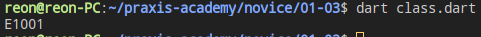

# Hari 3 | OOP pada Dart

###### Muhammad Noehidayatullah - Rabu, 7 Agustus 2019

## Ringkasan Materi

OOP (Object Oriented Programming) adalah suatu metode pemrograman yang berorientasi kepada objek. Tujuan dari OOP diciptakan adalah untuk mempermudah pengembangan program dengan cara mengikuti model yang telah ada di kehidupan sehari-hari.

### Class

Class adalah ‘cetak biru’ atau ‘blueprint’ dari object. Class digunakan hanya untuk membuat kerangka dasar. Yang akan kita pakai nantinya adalah hasil cetakan dari class, yakni object.

Contoh membuat **class** pada **Dart** :

```dart
class Car {
  String engine = "E1001";

  void disp() {
    print(engine);
  }
}

void main() {
  Car c = new Car();
  c.disp();
}
```

Hasil :



## Constructor

Konsktruktor adalah _method_ yang pertama kali dijalankan pada saat sebuah objek pertama kali diciptakan.

Perbedaan _method_ konstruktor dengan _method_ lainnya pada **_Dart_** adalah nama _method_ konstruktor harus sama dengan nama **class** nya.

Contoh Penggunaan konstruktor: File di <a href="constructor.dart">Konstruktor</a>

```dart
class Car {
  Car(String engine) {
    print(engine);
}

void main() {
  Car c = new Car('E1001');
}

```
