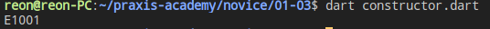
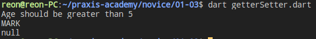
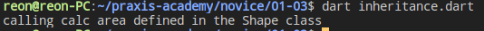

# Hari 3 | OOP pada Dart

###### Muhammad Noehidayatullah - Rabu, 7 Agustus 2019

## Ringkasan Materi

OOP (Object Oriented Programming) adalah suatu metode pemrograman yang berorientasi kepada objek. Tujuan dari OOP diciptakan adalah untuk mempermudah pengembangan program dengan cara mengikuti model yang telah ada di kehidupan sehari-hari.

### Class

Class adalah ‘cetak biru’ atau ‘blueprint’ dari object. Class digunakan hanya untuk membuat kerangka dasar. Yang akan kita pakai nantinya adalah hasil cetakan dari class, yakni object.

Contoh membuat **class** pada **Dart** :

```dart
class Car {
  String engine = "E1001";

  void disp() {
    print(engine);
  }
}

void main() {
  Car c = new Car();
  c.disp();
}
```

Hasil :


## Constructor

Konsktruktor adalah _method_ yang pertama kali dijalankan pada saat sebuah objek pertama kali diciptakan.

Perbedaan _method_ konstruktor dengan _method_ lainnya pada **_Dart_** adalah nama _method_ konstruktor harus sama dengan nama **class** nya.

Contoh Penggunaan konstruktor berada di file <a href="constructor.dart" target="blank">constructor.dart</a>

```dart
class Car {
  Car(String engine) {
    print(engine);
}

void main() {
  Car c = new Car('E1001');
}

```

Hasil :


## Getter & Setter

setter dan getter adalah dua method yang tugasnya untuk mengambil dan mengisi data ke dalam objek.

Contoh penggunaan Setter & Getter ada di file <a href="getterSetter.dart">getterSetter.dart</a>

```dart
class Student {
  String name;
  int age;

  String get stud_name {
    return name;
  }

  int get stud_age {
    return age;
  }

  void set stud_name(String name) {
    this.name = name;
  }

  void set stud_age(int age) {
    if (age <= 0) {
      print("Age should be greater than 5");
    } else {
      this.age = age;
    }
  }
}

void main() {
  Student s1 = new Student();
  s1.stud_name = 'MARK';
  s1.stud_age = 0;
  print(s1.stud_name);
  print(s1.stud_age);
}

```

Hasil :


## Inheritance

**Inheritance** merupakan pewarisan sifat dari kelas induk ke kelas anak nya. _Method_, _field_ pada kelas induk dapat digunakan juga pada kelas yang diwarisi ataupun sebaliknya.

Contoh penggunaan **inheritance** ada pada file <a href="inheritance.dart" >inheritance.dart</a>

```dart
class Shape {
  void call_area() {
    print("calling calc area defined in the Shape class");
  }
}

class Circle extends Shape {}

main() {
  var obj = new Circle();
  obj.call_area();
}

```

Hasil:


## Static Keyword

**Static** _keyword_ dapat diaplikasikan pada data member dari **_class_** seperti **fields**, **method**.

Contoh Penggunaan **Static** _keyword_ ada pada file <a href="staticKeyword.dart">staticKeyword.dart</a>

```dart
class StaticMem {
   static int num;
   static disp() {
      print("The value of num is ${StaticMem.num}")  ;
   }
}
void main() {
   StaticMem.num = 12;
   // initialize the static variable }
   StaticMem.disp();
   // invoke the static method
}
```

## Super Keyword

###Tes

Contoh Penggunaan **Static** _keyword_ ada pada file <a href="staticKeyword.dart">staticKeyword.dart</a>

```dart
void main() {
  Child c = new Child();
  c.m1(12);
}

class Parent {
  String msg = "message variable from the parent class";
  void m1(int a) {
    print("value of a ${a}");
  }
}

class Child extends Parent {
  @override
  void m1(int b) {
    print("value of b ${b}");
    super.m1(13);
    print("${super.msg}");
  }
}

```
