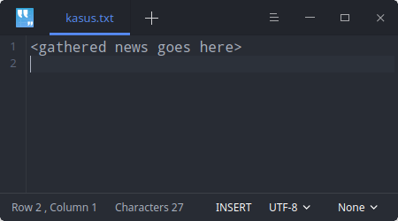

# Hari 5 | Asynchronous Programming, Konkurensi, dan Tooling

###### Muhammad Noerhidayatullah - Jum'at, 9 Agustus 2019

## `Asynchoronous`

Hasil eksekusi atau output tidak selalu berdasarkan urutan kode, tapi berdasarkan waktu proses.

### `Future`

Contoh :

```dart
import 'dart:async';
import 'dart:io';

void main() {
  File file = new File(Directory.current.path + "/contact.txt");
  Future<String> f = file.readAsString();

  // returns a future, this is Async method
  f.then((data) => print(data));

  // once file is read, call back method is invoked
  print("End of main");
  //this get printed first, showing fileReading is non blocking or async
}

```

Output:

```
End of main
1, Tom
2, John
3, Tim
4, Jane
```

Contoh :

```dart
import 'dart:async';

class Employee {
  int id;
  String firstName;
  String lastName;

  Employee(this.id, this.firstName, this.lastName);
}

void main() async {
  print("getting employee...");
  var x = await getEmployee(33);
  print("Got back ${x.firstName} ${x.lastName} with id# ${x.id}");
}

Future<Employee> getEmployee(int id) async {
  // Simulate what a real service call delay
  await Future<Employee>.delayed(const Duration(seconds: 2));
  // and then return an employee - lets pretend we grabbed this out of a database
  var e = new Employee(id, "Joe", "Coder");
  return e;
}

```

Output:

```
getting employee...
Got back Joe Coder with id# 33
```

Pada contoh diatas disimulasikan dengan memberikan _delay_ selama 2 detik sebelum menampilkan hasil `getEmployee(33)`.

## `Stream`

Contoh:

```dart
import 'dart:async';

Future<int> sumStream(Stream<int> stream) async {
  var sum = 0;
  await for (var value in stream) {
    sum += value;
  }
  return sum;
}

Stream<int> countStream(int to) async* {
  for (int i = 1; i <= to; i++) {
    yield i;
  }
}

void main() async {
  var stream = countStream(10);
  var sum = await sumStream(stream);
  print(sum);
}

```

Output:

```
5
```

## `Kasus`

Membuat program untuk mengakses atau mengambil konten pada suatu _endpoint_ / URL di Web menggunakan non-blocking _I/O (asynchronous)_. Kemudian hasil dari pengambilan disimpan dalam suatu file teks.

##### `1. Mengambil konten pada suatu endpoint/URL di web`

Untuk mengambil konten pada suatu endpoint di Web yaitu dengan menggunakan fungsi `HttpClient()` yang terdapat pada `dart:io`

```dart
import 'dart:async';
import 'dart:io';
import 'dart:convert';

Future<void> printDailyNewsDigest() async {
  var request =
      await HttpClient().getUrl(Uri.parse('https://dart.dev/f/dailyNewsDigest.txt'));
  var response = await request.close();

  // transforms and prints the response
  await for (var contents in response.transform(Utf8Decoder())) {
    print(contents);
  }
}

void main() {
  printDailyNewsDigest();
}

```

Output:

```
<gathered news goes here>
```

Sesuai dengan isi dari URL <a href="https://dart.dev/f/dailyNewsDigest.txt">https://dart.dev/f/dailyNewsDigest.txt</a>

##### `2. Mengkopi isi dari URL kedalam file teks`

Untuk mengkopi kedalam file teks yaitu dengan menggunakan fungsi `writeAsString()` dan untuk membaca isi dari sebuah file yaitu menggunakan fungsi `readAsString()`.
Berikut ini merupakan _source code_ untuk membaca dan menulis kedalam file pada **dart**.

```dart
import 'dart:io';

main() async {
  var file = File('data.txt');
  var contents;

  if (await file.exists()) {
    // Read file
    contents = await file.readAsString();
    print(contents);

    // Write file
    var fileCopy = await File('data-copy.txt').writeAsString(contents);
    print(await fileCopy.exists());
    print(await fileCopy.length());
  }
}

```

Output:

```
tes
true
3
```

##### `3. Menggabungkan dua source code untuk menyelesaikan kasus yang telah diberikan`

Berikut ini _source code_ kasus:

```dart
import 'dart:async';
import 'dart:io';
import 'dart:convert';

Future<void> printDailyNewsDigest() async {
  var request = await HttpClient()
      .getUrl(Uri.parse('https://dart.dev/f/dailyNewsDigest.txt'));
  var response = await request.close();

  // transforms and prints the response
  await for (var contents in response.transform(Utf8Decoder())) {
    print(contents);
    File('kasus.txt').writeAsString(contents);
  }
}

void main() {
  printDailyNewsDigest();
}

```

Output pada Terminal:

```
<gathered news goes here>

```

Output File `kasus.txt` :

