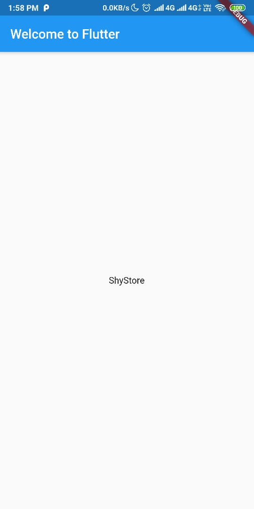
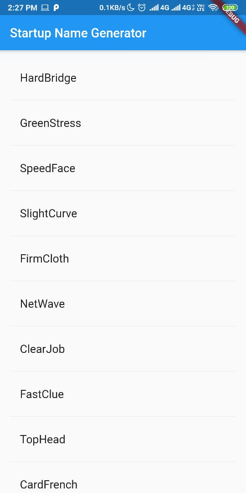
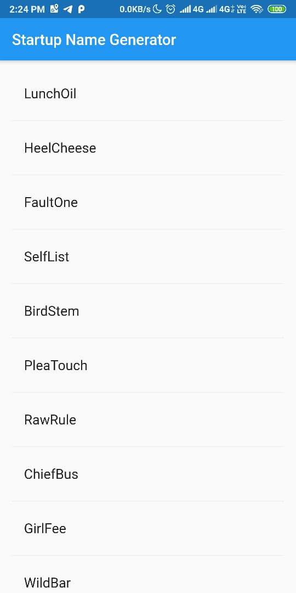
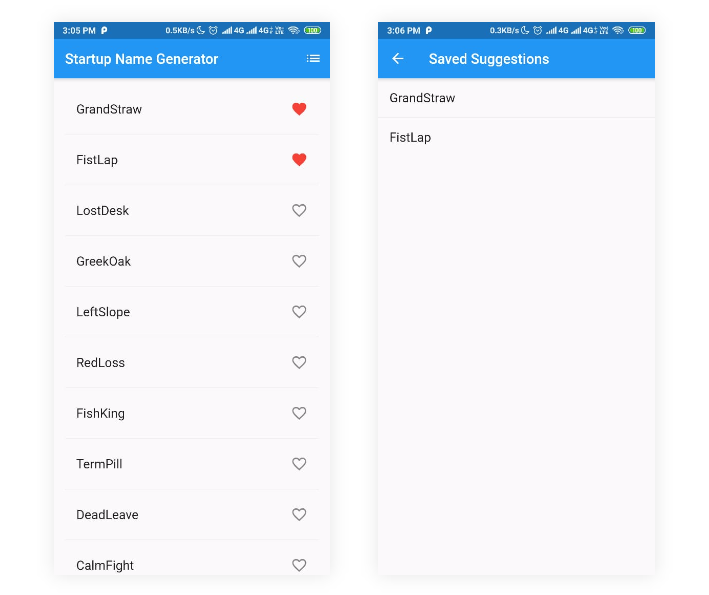

# Hari 6 | Memulai Flutter

# Kasus | Write Your First Flutter App Part 1

## Step 1: Membuat Flutter App | Hello World

1. Membuat project flutter dengan nama startup_namer.
2. Menampilkan tulisan 'Hello World' dengan cara menggati file `lib/main.dart' ganti isinya menjadi seperti pada code dibawah ini :

```dart
import 'package:flutter/material.dart';

void main() => runApp(MyApp());

class MyApp extends StatelessWidget {
  @override
  Widget build(BuildContext context) {
    return MaterialApp(
      title: 'Welcome to Flutter',
      home: Scaffold(
        appBar: AppBar(
          title: Text('Welcome to Flutter'),
        ),
        body: Center(
          child: Text('Hello World'),
        ),
      ),
    );
  }
}

```

3. Run aplikasi ke Android atau IOS dan hasilnya seperti berikut ini :

Output:


## Step 2: Menggunakan _Package_ External

Pada step ini kita akan menggunakan open-source package yang bernama <a href='https://pub.dev/packages/english_words'>english_words</a> yang berisi ribuan kata bahasa inggris.

1. Buka file [pubspec.yaml](pubspec.yaml) dan tambahkan `english_words: ^3.1.0`

```yaml
dependencies:
  flutter:
    sdk: flutter
  cupertino_icons: ^0.1.2
  english_words: ^3.1.0
```

2. Import package `english_words.dart` pada file [lib/main.dart](lib/main.dart)

```dart
import 'package:flutter/material.dart';
import 'package:english_words/english_words.dart';
```

3. Menggunakan package `english_words` [lib/main.dart](lib/main.dart), ganti pada `Text('Hello World')` menjadi `Text(wordPair.asPascalCase)`

```dart
import 'package:flutter/material.dart';
import 'package:english_words/english_words.dart';

void main() => runApp(MyApp());

class MyApp extends StatelessWidget {
  final wordPair = WordPair.random();

  @override
  Widget build(BuildContext context) {
    return MaterialApp(
      title: 'Welcome to Flutter',
      home: Scaffold(
        appBar: AppBar(
          title: Text('Welcome to Flutter'),
        ),
        body: Center(
          child: Text(wordPair.asPascalCase),
        ),
      ),
    );
  }
}

```

Output :



Text `Hello World` berganti menjadi text yang diambil dari `english_words`

## Step 3: Menambah Stateful Widget

1. Membuat state class `RandomWordsState` di baris paling bawah pada [lib/main.dart](lib/main.dart)

```dart
class RandomWordsState extends State<RandomWords> {

}
```

3. Menambahkan stateful `RandomWords` ke [lib/main.dart](lib/main.dart)

```dart
class RandomWords extends StatefulWidget {
  @override
  RandomWordsState createState() => RandomWordsState();
}
```

4. Menambahkan `build()` method di `RandomWordState`

```dart
class RandomWordsState extends State<RandomWords> {
  @override
  Widget build(BuildContext context) {
    final wordPair = WordPair.random();
    return Text(wordPair.asPascalCase);
  }
}
```

5. Pada class `MyApp` ganti `Text(wordPair.asPascalCase)` menjadi `RandomWords()`

```dart
class MyApp extends StatelessWidget {
  @override
  Widget build(BuildContext context) {
    return MaterialApp(
      title: 'Startup Name Generator',
      home: RandomWords(),
    );
  }
}
```

Output :


## Step 3: Membuat Infinite scrolling ListView

1.  Pada class `RandomWordsState` tambahkan seperti code berikut :

```dart
class RandomWordsState extends State<RandomWords> {
 final _suggestions = <WordPair>[];
 final _biggerFont = const TextStyle(fontSize: 18.0);
}
```

2. Menambahkan fungsi `_buildSuggestions()` pada class `RandomWordsState` :

```dart
Widget _buildSuggestions() {
  return ListView.builder(
      padding: const EdgeInsets.all(16.0),
      itemBuilder: (context, i) {
        if (i.isOdd) return Divider();

        final index = i ~/ 2;
        if (index >= _suggestions.length) {
          _suggestions.addAll(generateWordPairs().take(10));
        }
        return _buildRow(_suggestions[index]);
      });
}
```

3. Menambahkan fungsi `_buildRow()` pada class `RandomWordsState`

```dart
Widget _buildRow(WordPair pair) {
  return ListTile(
    title: Text(
      pair.asPascalCase,
      style: _biggerFont,
    ),
  );
}
```

4. Pada class `RandomWordsState` ubah `build()` method menjadi

```dart
@override
Widget build(BuildContext context) {
  return Scaffold(
    appBar: AppBar(
      title: Text('Startup Name Generator'),
    ),
    body: _buildSuggestions(),
  );
}
```

5. Di class `MyApp` update `build()`

```dart
class MyApp extends StatelessWidget {
  @override
  Widget build(BuildContext context) {
    return MaterialApp(
      title: 'Startup Name Generator',
      debugShowCheckedModeBanner: false,
      home: RandomWords(),
    );
  }
}
```

### Full Source Code `lib/main.dart`

```dart
import 'package:flutter/material.dart';
import 'package:english_words/english_words.dart';

void main() => runApp(MyApp());

class RandomWordsState extends State<RandomWords> {
  final _suggestions = <WordPair>[];
  final _biggerFont = const TextStyle(fontSize: 18.0);

  @override
  Widget build(BuildContext context) {
    return Scaffold(
      appBar: AppBar(
        title: Text('Startup Name Generator'),
      ),
      body: _buildSuggestions(),
    );
  }

  Widget _buildSuggestions() {
    return ListView.builder(
        padding: const EdgeInsets.all(16.0),
        itemBuilder: (context, i) {
          if (i.isOdd) return Divider();

          final index = i ~/ 2;
          if (index >= _suggestions.length) {
            _suggestions.addAll(generateWordPairs().take(10));
          }
          return _buildRow(_suggestions[index]);
        });
  }

  Widget _buildRow(WordPair pair) {
    return ListTile(
      title: Text(
        pair.asPascalCase,
        style: _biggerFont,
      ),
    );
  }
}

class RandomWords extends StatefulWidget {
  @override
  RandomWordsState createState() => RandomWordsState();
}

class MyApp extends StatelessWidget {
  @override
  Widget build(BuildContext context) {
    return MaterialApp(
      title: 'Startup Name Generator',
      home: RandomWords(),
    );
  }
}

```

Output:



> #### Info
>
> Untuk menghilangkan banner **debug** pada pojok kanan atas yaitu dengan cara pada `MaterialApp()` tambahkan `debugShowCheckedModeBanner: false`.
> Sehingga hasilnya menjadi seperti ini :
> 

## Step 4: Menambahkan Icon pada List

1. Pada class `RandomWordsState`

```dart
class RandomWordsState extends State<RandomWords> {
  final List<WordPair> _suggestions = <WordPair>[];
  final Set<WordPair> _saved = Set<WordPair>();
  final TextStyle _biggerFont = TextStyle(fontSize: 18.0);
  ...
}
```

2. Pada fungsi `_buildRow`

```dart
Widget _buildRow(WordPair pair) {
  final bool alreadySaved = _saved.contains(pair);
}
```

```dart
Widget _buildRow(WordPair pair) {
  final bool alreadySaved = _saved.contains(pair);
  return ListTile(
    title: Text(
      pair.asPascalCase,
      style: _biggerFont,
    ),
    trailing: Icon(
      alreadySaved ? Icons.favorite : Icons.favorite_border,
      color: alreadySaved ? Colors.red : null,
    ),
  );
}
```

## Step 5: Menambahkan Interaksi

1. Menambahkan `onTap`

```dart
Widget _buildRow(WordPair pair) {
  final alreadySaved = _saved.contains(pair);
  return ListTile(
    title: Text(
      pair.asPascalCase,
      style: _biggerFont,
    ),
    trailing: Icon(
      alreadySaved ? Icons.favorite : Icons.favorite_border,
      color: alreadySaved ? Colors.red : null,
    ),
    onTap: () {
      setState(() {
        if (alreadySaved) {
          _saved.remove(pair);
        } else {
          _saved.add(pair);
        }
      });
    },
  );
}
```

## Step 6: Navigasi ke Layar Baru

Menambahkan icon pada `build` method:

```dart
class RandomWordsState extends State<RandomWords> {
  ...
  @override
  Widget build(BuildContext context) {
    return Scaffold(
      appBar: AppBar(
        title: Text('Startup Name Generator'),
        actions: <Widget>[
          IconButton(icon: Icon(Icons.list), onPressed: _pushSaved),
        ],
      ),
      body: _buildSuggestions(),
    );
  }
  ...
}
```

Menambahkan fungsi `_pushSaved()` pada class `RandomWordsState`

```dart
void _pushSaved() {
  Navigator.of(context).push(
    MaterialPageRoute<void>(
      builder: (BuildContext context) {
        final Iterable<ListTile> tiles = _saved.map(
          (WordPair pair) {
            return ListTile(
              title: Text(
                pair.asPascalCase,
                style: _biggerFont,
              ),
            );
          },
        );
        final List<Widget> divided = ListTile
          .divideTiles(
            context: context,
            tiles: tiles,
          )
              .toList();

        return Scaffold(         // Add 6 lines from here...
          appBar: AppBar(
            title: Text('Saved Suggestions'),
          ),
          body: ListView(children: divided),
        );                       // ... to here.
      },
    ),
  );
}
```

## Full Source Code

```dart
import 'package:flutter/material.dart';
import 'package:english_words/english_words.dart';

void main() => runApp(MyApp());

class RandomWordsState extends State<RandomWords> {
  final _suggestions = <WordPair>[];
  final Set<WordPair> _saved = Set<WordPair>();
  final _biggerFont = const TextStyle(fontSize: 18.0);

  void _pushSaved() {
    Navigator.of(context).push(
      MaterialPageRoute<void>(
        builder: (BuildContext context) {
          final Iterable<ListTile> tiles = _saved.map(
            (WordPair pair) {
              return ListTile(
                title: Text(
                  pair.asPascalCase,
                  style: _biggerFont,
                ),
              );
            },
          );
          final List<Widget> divided = ListTile.divideTiles(
            context: context,
            tiles: tiles,
          ).toList();

          return Scaffold(
            appBar: AppBar(
              title: Text('Saved Suggestions'),
            ),
            body: ListView(children: divided),
          );
        },
      ),
    );
  }

  @override
  Widget build(BuildContext context) {
    return Scaffold(
      appBar: AppBar(
        title: Text('Startup Name Generator'),
        actions: <Widget>[
          IconButton(
            icon: Icon(Icons.list),
            onPressed: _pushSaved,
          ),
        ],
      ),
      body: _buildSuggestions(),
    );
  }

  Widget _buildSuggestions() {
    return ListView.builder(
        padding: const EdgeInsets.all(16.0),
        itemBuilder: (context, i) {
          if (i.isOdd) return Divider();

          final index = i ~/ 2;
          if (index >= _suggestions.length) {
            _suggestions.addAll(generateWordPairs().take(10));
          }
          return _buildRow(_suggestions[index]);
        });
  }

  Widget _buildRow(WordPair pair) {
    final bool alreadySaved = _saved.contains(pair);
    return ListTile(
      title: Text(
        pair.asPascalCase,
        style: _biggerFont,
      ),
      trailing: Icon(
        alreadySaved ? Icons.favorite : Icons.favorite_border,
        color: alreadySaved ? Colors.red : null,
      ),
      onTap: () {
        setState(() {
          if (alreadySaved) {
            _saved.remove(pair);
          } else {
            _saved.add(pair);
          }
        });
      },
    );
  }
}

class RandomWords extends StatefulWidget {
  @override
  RandomWordsState createState() => RandomWordsState();
}

class MyApp extends StatelessWidget {
  @override
  Widget build(BuildContext context) {
    return MaterialApp(
      title: 'Startup Name Generator',
      debugShowCheckedModeBanner: false,
      home: RandomWords(),
    );
  }
}

```

Output:


<!--  -->
