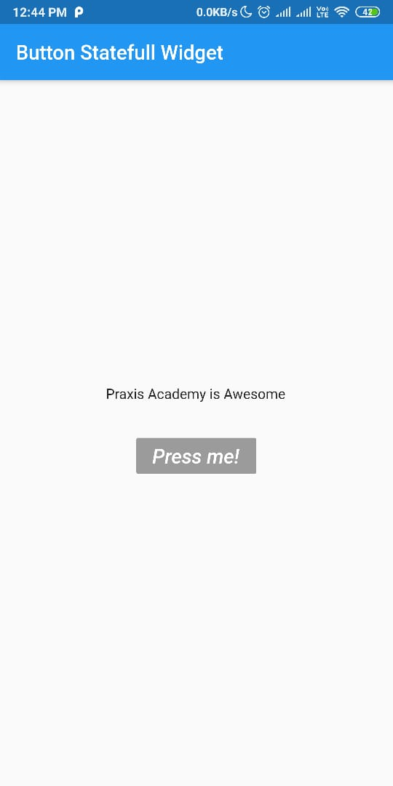
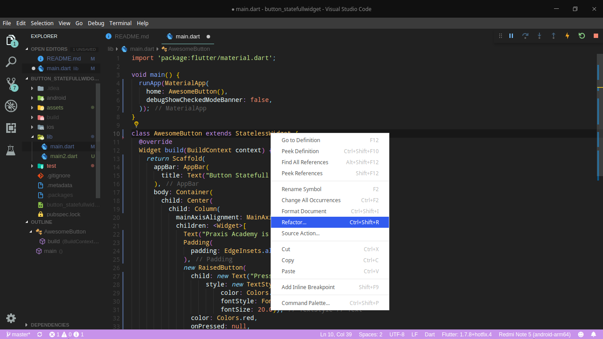
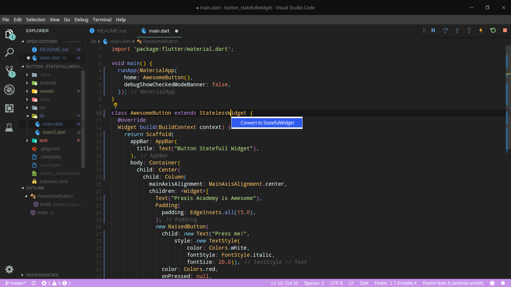
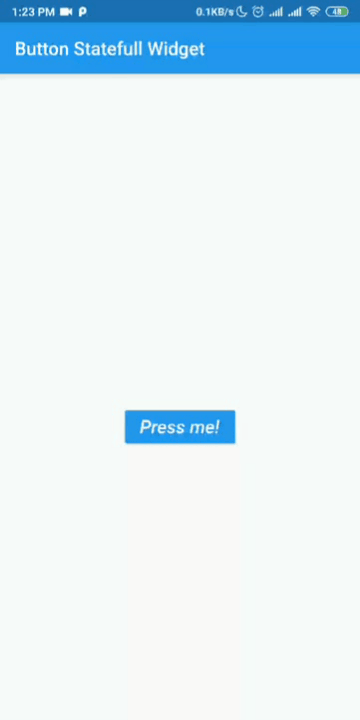

# Hari 7 | Mengenal Widgets dan Layout

##### Muhammad Noerhidayatullah | Selasa, 13 Agustus 2019

## Kasus 2 | Button Statefull Widget

`StatefullWidget` merupakan widget yang dapat berubah secara dinamis. Jadi **apabila terdapat widget yang kita ingin rubah-rubah nilainya** kita menggunakan **`StatefullWidget`** sedangkan **apabila hanya berupa tampilan yang tidak berubah** kita menggunakan **`StatelessWidget`**.

### Membuat StatelessWidget Terlebih Dahulu

### `main()`

Atur home untuk mengarah ke class `AwesomeButton`, karena kita akan membuat class `AwesomeButton` untuk isi dari tampilannya.

```dart
import 'package:flutter/material.dart';

void main() {
  runApp(MaterialApp(
    home: AwesomeButton(),
    debugShowCheckedModeBanner: false,
  ));
}
```

### Membuat class `AwesomeButton` dengan `StatelessWidget` terlebih dahulu

```dart
class AwesomeButton extends StatelessWidget {
  @override
  Widget build(BuildContext context) {
    return Scaffold(
      appBar: AppBar(
        title: Text("Button Statefull Widget"),
      ),
      body: Container(
        child: Center(
          child: Column(
            mainAxisAlignment: MainAxisAlignment.center,
            children: <Widget>[
              Text("Praxis Academy is Awesome",
              style: TextStyle(
                  fontSize: 30.0,
                  fontWeight: FontWeight.bold,
              ),
              Padding(
                padding: EdgeInsets.all(15.0),
              ),
              new RaisedButton(
                child: new Text("Press me!",
                    style: new TextStyle(
                        color: Colors.white,
                        fontStyle: FontStyle.italic,
                        fontSize: 20.0)),
                color: Colors.blue,
                onPressed: null,
              )
            ],
          ),
        ),
      ),
    );
  }
}
```

Output:


### Mengubah class `AwesomeButton` dari `StatelessWidget` menjadi `StatelessWidget`




### Meneyelesaikan

Tambahkan code dibawah ini ke dalam class `_AwesomeButtonState`

```dart
int counter = 0;
List<String> strings = ['Praxis', 'Academy', 'is', 'Awesome'];
String displayedString = "";

void onPressed() {
  setState(() {
    displayedString = strings[counter];
    counter = counter < 3 ? counter + 1 : 0;
  });
}
```

Mengubah isi dari tulisan **_Praxis Academy is Awesome_** menjadi variabel `displayString` dan pada `RaisedButton` isi `onPressed` memanggil fungsi `onPressed`.

##### Source Code Lengkap

```dart
import 'package:flutter/material.dart';

void main() {
  runApp(MaterialApp(
    home: AwesomeButton(),
    debugShowCheckedModeBanner: false,
  ));
}

class AwesomeButton extends StatefulWidget {
  @override
  _AwesomeButtonState createState() => _AwesomeButtonState();
}

class _AwesomeButtonState extends State<AwesomeButton> {
  int counter = 0;
  List<String> strings = ['Praxis', 'Academy', 'is', 'Awesome'];
  String displayedString = "";

  void onPressed() {
    setState(() {
      displayedString = strings[counter];
      counter = counter < 3 ? counter + 1 : 0;
    });
  }

  @override
  Widget build(BuildContext context) {
    return Scaffold(
      appBar: AppBar(
        title: Text("Button Statefull Widget"),
      ),
      body: Container(
        child: Center(
          child: Column(
            mainAxisAlignment: MainAxisAlignment.center,
            children: <Widget>[
              Text(
                displayedString,
                style: TextStyle(
                  fontSize: 30.0,
                  fontWeight: FontWeight.bold,
                ),
              ),
              Padding(
                padding: EdgeInsets.all(15.0),
              ),
              RaisedButton(
                child: Text("Press me!",
                    style: TextStyle(
                        color: Colors.white,
                        fontStyle: FontStyle.italic,
                        fontSize: 20.0)),
                color: Colors.blue,
                onPressed: onPressed,
              )
            ],
          ),
        ),
      ),
    );
  }
}

```

Output:

