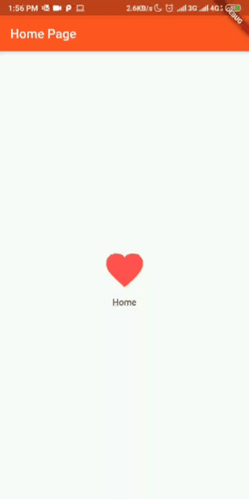

# Hari 7 | Mengenal Widgets dan Layout

##### Muhammad Noerhidayatullah | Selasa, 13 Agustus 2019

## Kasus 3.1 | Simple routes using StatelessWidget

## `main()`

```dart
void main() {
  runApp(
    new MaterialApp(home: new HomePage(), routes: <String, WidgetBuilder>{
      "/SecondPage": (BuildContext context) => new SecondPage()
    }),
  );
}
```

pada fungsi `main()` untuk melakukan navigasi pada `StatelessWidget` dengan menambahkan `routes` dan memberikannya nama `/SeconPage` yang akan ke class `SeconPage()`.

### Membuat class `HomePage`

```dart
class HomePage extends StatelessWidget {
  @override
  Widget build(BuildContext context) {
    return new Scaffold(
      appBar: new AppBar(
          title: new Text("Home Page"), backgroundColor: Colors.deepOrange),
      body: new Container(
        child: new Center(
          child: new Column(
            mainAxisAlignment: MainAxisAlignment.center,
            children: <Widget>[
              new IconButton(
                  icon: new Icon(Icons.favorite, color: Colors.redAccent),
                  iconSize: 70.0,
                  onPressed: () {
                    Navigator.of(context).pushNamed("/SecondPage");
                  }),
              new Text("Home")
            ],
          ),
        ),
      ),
    );
  }
}
```

Pada `IconButton()` dengan memberikan keyword `onPressed` dan mengarahkannya pada `"/SeconPage"`

### Membuat class `SecondPage`

```dart
class SecondPage extends StatelessWidget {
  @override
  Widget build(BuildContext context) {
    return new Scaffold(
      appBar: new AppBar(
          title: new Text("Second Page"), backgroundColor: Colors.deepOrange),
      body: new Container(
        child: new Center(
          child: new Column(
            mainAxisAlignment: MainAxisAlignment.center,
            children: <Widget>[
              new IconButton(
                icon: new Icon(Icons.home, color: Colors.blue),
                iconSize: 70.0,
                onPressed: null,
              ),
              new Text("Second Page")
            ],
          ),
        ),
      ),
    );
  }
}
```

Output:

