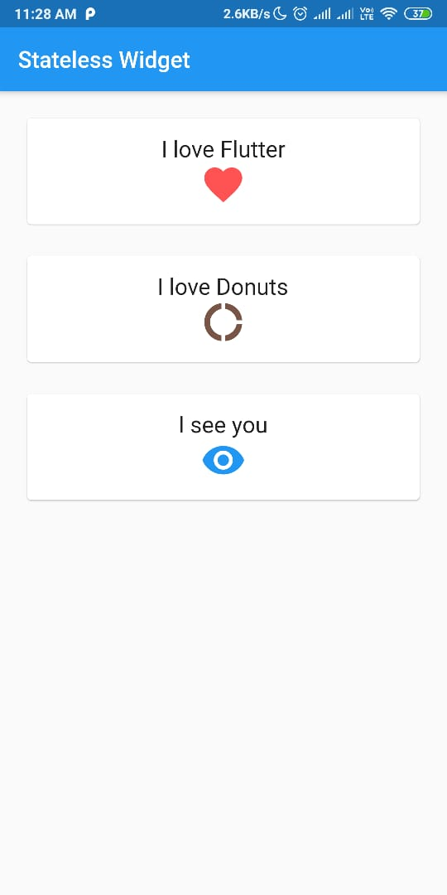

# Hari 7 | Mengenal Widgets dan Layout

#### Muhammad Noerhidayatullah | Selasa, 13 Agustus 2019

## Kasus 1 | Stateless Widget

Stateless Widget merupakan widget **Flutter** yang dibuild hanya dengan konfigurasi yang telah diinisiasi sejak awal atau widget yang tidak akan pernah berubah

### Membuat Class `MyStatelessWidget`

```dart
class MyStatelessWidget extends StatelessWidget {
  @override
  Widget build(BuildContext context) {
    return ...nanti akan diisi dengan widget
    ...
  }
}
```

dan pada _function_ ``

#### - `Scaffold()` widget

Pada `build()` di class `MyStatelessWidget` return `Scaffold()` dan tambahkan **appBar** dan **body**.
pada **body** tambahkan `Container()` widget

```dart
@override
Widget build(BuildContext context) {
  return Scaffold(
    appBar: AppBar(
      title: Text("Stateless Widget"),
    ),
    body: Container(),
  );
}

```

#### - `Container()` widget

Pada dalam `Container()` menambahkan `padding` untuk memberikan jarak serta tambahkan `child` yang merupakan isi dari widget `Container()`

> #### Info :
>
> `Container()` hanya bisa menampung satu **widget** saja, untuk menampung banyak **widget** menggunakan `Coloumn()`, `Row()`,

```dart
Container(
  padding: EdgeInsets.all(20.0),
  child: Column(),
),
```

#### -`Column()` widget

Widget `Column()` digunakan untuk mengatur layout dengan **children** per kolom atau per baris. Pada `Column()` menambhkan `crossAxisAlignment` dan `children`

```dart
Column(
  crossAxisAlignment: CrossAxisAlignment.stretch,
  children: <Widget>[
    ...berisi widget
  ],
),
```

#### Membuat class `MyCard`

Class `MyCard` akan digunakan untuk isi dari children pada widget `Column()` diatas dan berisi widget `Card()` yang tampil seperti seperti kartu-kartu.

```dart
class MyCard extends StatelessWidget {
  MyCard({this.title, this.icon});

  final Widget title;
  final Widget icon;

  @override
  Widget build(BuildContext context) {
    return Container(
      padding: EdgeInsets.only(bottom: 20.0),
      child: Card(
        child: Container(
          padding: EdgeInsets.all(15.0),
          child: Column(children: <Widget>[this.title, this.icon]),
        ),
      ),
    );
  }
}
```

##### Source Code lengkap kasus 1

```dart
import 'package:flutter/material.dart';

void main() {
  runApp(MaterialApp(
    home: MyStatelessWidget(),
    debugShowCheckedModeBanner: false,
  ));
}

class MyStatelessWidget extends StatelessWidget {
  @override
  Widget build(BuildContext context) {
    return Scaffold(
      appBar: AppBar(
        title: Text("Stateless Widget"),
      ),
      body: Container(
        padding: EdgeInsets.all(20.0),
        child: Column(
          crossAxisAlignment: CrossAxisAlignment.stretch,
          children: <Widget>[
            MyCard(
                title: Text("I love Flutter", style: TextStyle(fontSize: 20.0)),
                icon:
                    Icon(Icons.favorite, size: 40.0, color: Colors.redAccent)),
            MyCard(
                title: Text("I love Donuts", style: TextStyle(fontSize: 20.0)),
                icon: Icon(Icons.donut_large, size: 40.0, color: Colors.brown)),
            MyCard(
                title: Text("I see you", style: TextStyle(fontSize: 20.0)),
                icon: Icon(Icons.visibility, size: 40.0, color: Colors.blue))
          ],
        ),
      ),
    );
  }
}

class MyCard extends StatelessWidget {
  MyCard({this.title, this.icon});

  final Widget title;
  final Widget icon;

  @override
  Widget build(BuildContext context) {
    return Container(
      padding: EdgeInsets.only(bottom: 20.0),
      child: Card(
        child: Container(
          padding: EdgeInsets.all(15.0),
          child: Column(children: <Widget>[this.title, this.icon]),
        ),
      ),
    );
  }
}

```

Output:

