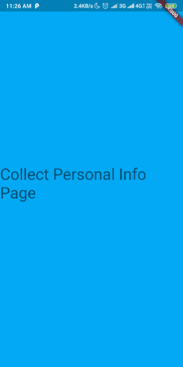

# Hari 8 | Aset dan Navigasi

###### Muhammad Noerhidayatullah | Rabu, 14 Agustus 2019

## Kasus 2 | Navigator Class

Pada widget `MaterialApp()` untuk membuat **navigation** yaitu dengan menggunakan `routes` dan menginisialisasi nama `route` serta akan mengarah ke `class` mana.

```dart
initialRoute: '/',
routes: {
  '/': (BuildContext context) => HomePage(),
  '/signup': (BuildContext context) => SignUpPage(),
},
```

Seperti code diatas terdapat 2 `route` yang dibuat yaitu

```dart
'/': (BuildContext context) => HomePage()
```

yang akan mengarah ke _class_ `HomePage()` dan

```dart
'/signup': (BuildContext context) => SignUpPage()
```

yang mengarah ke _class_ `SignUpPage()`

dan `initialRoute` berfungsi sebagai nilai awal `route` yang dijalankan saat aplikasi berjalan.

### Class SignUpPage

Pada _class_ `SignUpPage` return ke `Navigator()` dengan `initialRoute:'signup/personal_info'` yang mengarah ke _class_ `CollectPersonalInfoPage()`

```dart
class SignUpPage extends StatelessWidget {
  @override
  Widget build(BuildContext context) {
    // SignUpPage builds its own Navigator which ends up being a nested
    // Navigator in our app.
    return Navigator(
      initialRoute: 'signup/personal_info',
      onGenerateRoute: (RouteSettings settings) {
        WidgetBuilder builder;
        switch (settings.name) {
          case 'signup/personal_info':
            // Assume CollectPersonalInfoPage collects personal info and then
            // navigates to 'signup/choose_credentials'.
            builder = (BuildContext _) => CollectPersonalInfoPage();
            break;
          case 'signup/choose_credentials':
            // Assume ChooseCredentialsPage collects new credentials and then
            // invokes 'onSignupComplete()'.
            builder = (BuildContext _) => ChooseCredentialsPage(
                  onSignupComplete: () {
                    // Referencing Navigator.of(context) from here refers to the
                    // top level Navigator because SignUpPage is above the
                    // nested Navigator that it created. Therefore, this pop()
                    // will pop the entire "sign up" journey and return to the
                    // "/" route, AKA HomePage.
                    Navigator.of(context).pop();
                  },
                );
            break;
          default:
            throw Exception('Invalid route: ${settings.name}');
        }
        return MaterialPageRoute(builder: builder, settings: settings);
      },
    );
  }
}

```

### Class CollectPersonalInfoPage

```dart
class CollectPersonalInfoPage extends StatelessWidget {
  @override
  Widget build(BuildContext context) {
    return DefaultTextStyle(
      style: Theme.of(context).textTheme.display1,
      child: GestureDetector(
        onTap: () {
          // This moves from the personal info page to the credentials page,
          // replacing this page with that one.
          Navigator.of(context)
              .pushReplacementNamed('signup/choose_credentials');
        },
        child: Container(
          color: Colors.lightBlue,
          alignment: Alignment.center,
          child: Text('Collect Personal Info Page'),
        ),
      ),
    );
  }
}
```

Pada _class_ `CollectPersonalInfoPage` pada widget `GestureDetector()` diberikan `onTap` yang berisi fungsi untuk navigasi ke

### Class ChooseCredentialsPage

```dart
class ChooseCredentialsPage extends StatelessWidget {
  const ChooseCredentialsPage({
    this.onSignupComplete,
  });

  final VoidCallback onSignupComplete;

  @override
  Widget build(BuildContext context) {
    return GestureDetector(
      onTap: onSignupComplete,
      child: DefaultTextStyle(
        style: Theme.of(context).textTheme.display1,
        child: Container(
          color: Colors.pinkAccent,
          alignment: Alignment.center,
          child: Text('Choose Credentials Page'),
        ),
      ),
    );
  }
}
```

### Class HomePage

```dart
class HomePage extends StatelessWidget {
  @override
  Widget build(BuildContext context) {
    return DefaultTextStyle(
      style: Theme.of(context).textTheme.display1,
      child: Container(
        color: Colors.white,
        alignment: Alignment.center,
        child: Text('Home Page'),
      ),
    );
  }
}
```

Output:

