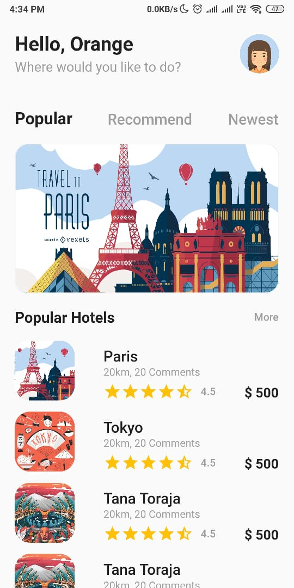
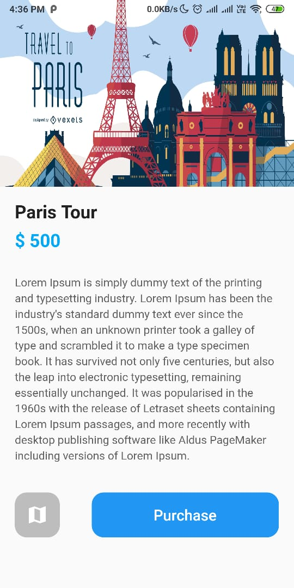

# Hari 9 | Animasi pada Flutter

###### Muhammad Noerhidayatullah | Kamis, 15 Agustus 2019

## Hero Animation pada Travel App






### MyHomePage Class

```dart
class MyHomePage extends StatelessWidget {
  @override
  Widget build(BuildContext context) {
    return Scaffold(
      backgroundColor: Colors.grey[50],
      body: ListView(
        children: <Widget>[
          Padding(
            padding: EdgeInsets.all(20),
            child: Row(
              mainAxisAlignment: MainAxisAlignment.spaceBetween,
              children: <Widget>[
                Column(
                  crossAxisAlignment: CrossAxisAlignment.start,
                  children: <Widget>[
                    Text(
                      "Hello, Orange",
                      style: TextStyle(
                        fontWeight: FontWeight.bold,
                        fontSize: 26.0,
                      ),
                    ),
                    SizedBox(
                      height: 5.0,
                    ),
                    Text(
                      "Where would you like to do?",
                      style: TextStyle(
                        fontWeight: FontWeight.w400,
                        color: Colors.grey,
                        fontSize: 18.0,
                      ),
                    ),
                  ],
                ),
                CircleAvatar(
                  backgroundImage: AssetImage("assets/images/girl.png"),
                  radius: 26,
                ),
              ],
            ),
          ),
          SizedBox(
            height: 26.0,
          ),
          Padding(
            padding: const EdgeInsets.only(left: 20.0, right: 20.0),
            child: Row(
              mainAxisAlignment: MainAxisAlignment.spaceBetween,
              children: <Widget>[
                GestureDetector(
                  child: Text(
                    "Popular",
                    style: TextStyle(
                      fontSize: 22.0,
                      fontWeight: FontWeight.bold,
                    ),
                  ),
                  onTap: () {},
                ),
                GestureDetector(
                  child: Text(
                    "Recommend",
                    style: TextStyle(
                      color: Colors.grey,
                      fontSize: 20.0,
                      fontWeight: FontWeight.w500,
                    ),
                  ),
                  onTap: () {
                    print("recommend");
                  },
                ),
                GestureDetector(
                  child: Text(
                    "Newest",
                    style: TextStyle(
                      color: Colors.grey,
                      fontSize: 20.0,
                      fontWeight: FontWeight.w500,
                    ),
                  ),
                  onTap: () {
                    print("newest");
                  },
                ),
              ],
            ),
          ),
          SizedBox(
            height: 20.0,
          ),
          Padding(
            padding: const EdgeInsets.only(left: 20, right: 20),
            child: Hero(
                tag: 'imageHero',
                child: GestureDetector(
                  onTap: () {
                    Navigator.push(
                      context,
                      MaterialPageRoute(builder: (context) => DetailPage()),
                    );
                  },
                  child: Container(
                    height: 200,
                    width: double.infinity,
                    decoration: BoxDecoration(
                      border: Border.all(color: Colors.grey[100]),
                      borderRadius: new BorderRadius.all(Radius.circular(18)),
                      color: Colors.blue,
                      image: DecorationImage(
                        image: AssetImage("assets/images/paris.jpg"),
                        fit: BoxFit.fill,
                      ),
                    ),
                  ),
                )),
          ),
          SizedBox(
            height: 10.0,
          ),
          Padding(
            padding: EdgeInsets.only(left: 20, right: 20, top: 10, bottom: 10),
            child: Row(
              mainAxisAlignment: MainAxisAlignment.spaceBetween,
              children: <Widget>[
                Text(
                  "Popular Hotels",
                  style: TextStyle(
                    fontWeight: FontWeight.bold,
                    fontSize: 20.0,
                  ),
                ),
                Text(
                  "More",
                  style: TextStyle(
                    color: Colors.grey,
                    fontWeight: FontWeight.w500,
                  ),
                ),
              ],
            ),
          ),
          Padding(
            padding:
                const EdgeInsets.only(left: 20, right: 20, top: 10, bottom: 10),
            child: Column(
              children: <Widget>[
                new ListHotel(
                  title: "Paris",
                  image: "assets/images/paris.jpg",
                ),
                SizedBox(
                  height: 15.0,
                ),
                new ListHotel(
                  title: "Tokyo",
                  image: "assets/images/tokyo.jpg",
                ),
                SizedBox(
                  height: 15.0,
                ),
                new ListHotel(
                  title: "Tana Toraja",
                  image: "assets/images/tanatoraja.jpg",
                ),
                SizedBox(
                  height: 15.0,
                ),
                new ListHotel(
                  title: "Tana Toraja",
                  image: "assets/images/tanatoraja.jpg",
                ),
                SizedBox(
                  height: 15.0,
                ),
                new ListHotel(
                  title: "Tana Toraja",
                  image: "assets/images/tanatoraja.jpg",
                ),
                SizedBox(
                  height: 15.0,
                ),
                new ListHotel(
                  title: "Tana Toraja",
                  image: "assets/images/tanatoraja.jpg",
                ),
              ],
            ),
          )
        ],
      ),
    );
  }
}
```

### ListHotel Class

```dart
class ListHotel extends StatelessWidget {
  const ListHotel({Key key, this.title, this.image}) : super(key: key);

  final String title;
  final String image;

  @override
  Widget build(BuildContext context) {
    return GestureDetector(
      onTap: () {
        Navigator.push(
          context,
          MaterialPageRoute(builder: (context) => DetailPage()),
        );
      },
      child: Row(
        mainAxisAlignment: MainAxisAlignment.spaceBetween,
        crossAxisAlignment: CrossAxisAlignment.end,
        children: <Widget>[
          Container(
            height: 80,
            width: 80,
            decoration: BoxDecoration(
                borderRadius: BorderRadius.all(Radius.circular(20)),
                image: DecorationImage(
                    image: AssetImage(image), fit: BoxFit.cover)),
          ),
          Column(
            crossAxisAlignment: CrossAxisAlignment.start,
            children: <Widget>[
              Text(
                title,
                style: TextStyle(
                  fontSize: 20,
                  fontWeight: FontWeight.w500,
                ),
              ),
              SizedBox(
                height: 2.0,
              ),
              Text(
                "20km, 20 Comments",
                style: TextStyle(
                  fontSize: 14,
                  color: Colors.grey,
                ),
              ),
              SizedBox(
                height: 6.0,
              ),
              Row(
                children: <Widget>[
                  Icon(
                    Icons.star,
                    color: Colors.amber,
                  ),
                  Icon(
                    Icons.star,
                    color: Colors.amber,
                  ),
                  Icon(
                    Icons.star,
                    color: Colors.amber,
                  ),
                  Icon(
                    Icons.star,
                    color: Colors.amber,
                  ),
                  Icon(
                    Icons.star_half,
                    color: Colors.amber,
                  ),
                  SizedBox(
                    width: 10.0,
                  ),
                  Text(
                    "4.5",
                    style: TextStyle(
                      color: Colors.grey,
                      fontWeight: FontWeight.w500,
                    ),
                  ),
                ],
              ),
            ],
          ),
          Text(
            "\$ 500",
            style: TextStyle(fontWeight: FontWeight.bold, fontSize: 18.0),
          ),
        ],
      ),
    );
  }
}
```

### DetailPage Class

```dart
class DetailPage extends StatelessWidget {
  String isi =
      "Lorem Ipsum is simply dummy text of the printing and typesetting industry. Lorem Ipsum has been the industry's standard dummy text ever since the 1500s, when an unknown printer took a galley of type and scrambled it to make a type specimen book. It has survived not only five centuries, but also the leap into electronic typesetting, remaining essentially unchanged. It was popularised in the 1960s with the release of Letraset sheets containing Lorem Ipsum passages, and more recently with desktop publishing software like Aldus PageMaker including versions of Lorem Ipsum.";

  @override
  Widget build(BuildContext context) {
    return Scaffold(
      body: Column(
        mainAxisAlignment: MainAxisAlignment.start,
        crossAxisAlignment: CrossAxisAlignment.start,
        children: <Widget>[
          GestureDetector(
            onTap: () {
              Navigator.push(
                context,
                MaterialPageRoute(builder: (context) => MyHomePage()),
              );
            },
            child: Hero(
              tag: 'imageHero',
              child: Container(
                height: 250,
                width: double.infinity,
                decoration: BoxDecoration(
                  image: DecorationImage(
                    image: AssetImage("assets/images/paris.jpg"),
                    fit: BoxFit.fill,
                  ),
                ),
              ),
            ),
          ),
          Padding(
            padding: const EdgeInsets.all(20.0),
            child: Column(
              crossAxisAlignment: CrossAxisAlignment.start,
              children: <Widget>[
                Text(
                  "Paris Tour",
                  style: TextStyle(
                    fontSize: 24.0,
                    fontWeight: FontWeight.bold,
                  ),
                ),
                SizedBox(
                  height: 10.0,
                ),
                Text(
                  "\$ 500",
                  style: TextStyle(
                    color: Colors.lightBlue,
                    fontSize: 24.0,
                    fontWeight: FontWeight.bold,
                  ),
                ),
                SizedBox(
                  height: 30.0,
                ),
                Text(
                  isi,
                  style: TextStyle(
                    color: Colors.grey[700],
                    fontSize: 15.0,
                    height: 1.2,
                  ),
                )
              ],
            ),
          ),
          SizedBox(
            height: 10.0,
          ),
          Padding(
            padding:
                const EdgeInsets.only(left: 20, right: 20, top: 10, bottom: 10),
            child: Row(
              mainAxisAlignment: MainAxisAlignment.spaceBetween,
              children: <Widget>[
                Container(
                  width: 60,
                  height: 60,
                  // color: Colors.blue,
                  decoration: BoxDecoration(
                    color: Colors.grey[400],
                    borderRadius: BorderRadius.all(
                      Radius.circular(16),
                    ),
                  ),
                  child: Icon(
                    Icons.map,
                    color: Colors.white,
                    size: 30,
                  ),
                ),
                Container(
                  height: 60,
                  width: 250,
                  decoration: BoxDecoration(
                      color: Colors.blue,
                      borderRadius: BorderRadius.all(
                        Radius.circular(16),
                      )),
                  child: Center(
                    child: Text(
                      "Purchase",
                      style: TextStyle(
                        color: Colors.white,
                        fontSize: 20.0,
                        fontWeight: FontWeight.w500,
                      ),
                    ),
                  ),
                )
              ],
            ),
          ),
        ],
      ),
    );
  }
}
```

Output:

