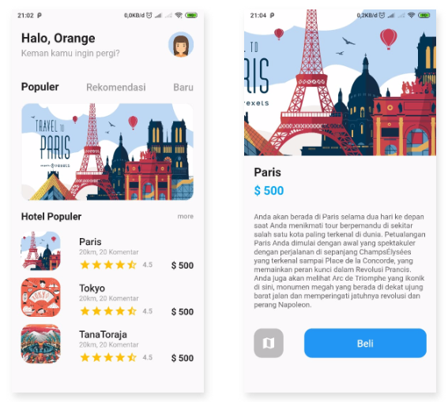
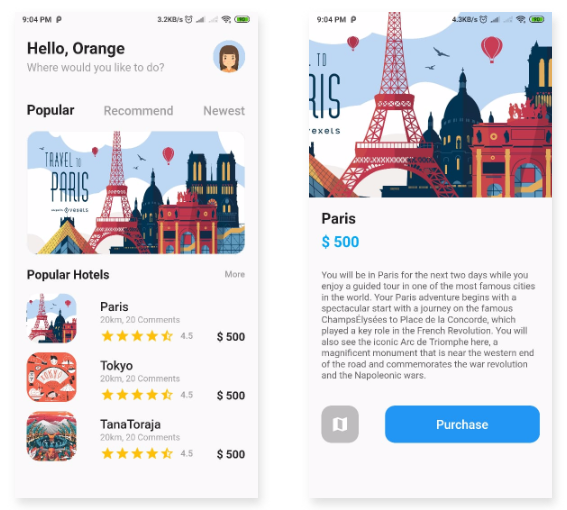

# Hari 15 | Internasionalisasi dan Lokalisasi Aplikasi

###### Muhammad Noerhidayatullah | Kamis, 25 Agustus 2019

## Lokalisasi English dan Indonesia pada Travel App

Membuat aplikasi Travel App menjadi multilingual saat bahasa pada smartphone dirubah ke bahasa **Inggris** maka aplikasi akan berbahasa **Inggris** dan jika bahasa pada smartphone dirubah ke bahasa **Indonesia** maka aplikasi akan berbahasa **Indonesia**.

#### Membuat file `lang/en.json` dan `lang/id.json`

File ini akan digunakan untuk menampung kalimat agar aplikasi dapat multilingual

##### `en.json`

```json
{
  "greeting": "Hello, Orange",
  "question": "Where would you like to do?",
  "popular": "Popular",
  "recommend": "Recommend",
  "newest": "Newest",
  "popularHotels": "Popular Hotels",
  "more": "More",
  "comments": "20km, 20 Comments",
  "details": "You will be in Paris for the next two days while you enjoy a guided tour in one of the most famous cities in the world. Your Paris adventure begins with a spectacular start with a journey on the famous ChampsÉlysées to Place de la Concorde, which played a key role in the French Revolution. You will also see the iconic Arc de Triomphe here, a magnificent monument that is near the western end of the road and commemorates the war revolution and the Napoleonic wars.",
  "purchase": "Purchase"
}
```

##### `id.json`

```json
{
  "greeting": "Halo, Orange",
  "question": "Keman kamu ingin pergi?",
  "popular": "Populer",
  "recommend": "Rekomendasi",
  "newest": "Baru",
  "popularHotels": "Hotel Populer",
  "more": "more",
  "comments": "20km, 20 Komentar",
  "details": "Anda akan berada di Paris selama dua hari ke depan saat Anda menikmati tour berpemandu di sekitar salah satu kota paling terkenal di dunia. Petualangan Paris Anda dimulai dengan awal yang spektakuler dengan perjalanan di sepanjang ChampsÉlysées yang terkenal sampai Place de la Concorde, yang memainkan peran kunci dalam Revolusi Prancis. Anda juga akan melihat Arc de Triomphe yang ikonik di sini, monumen megah yang berada di dekat ujung barat jalan dan memperingati jatuhnya revolusi dan perang Napoleon.",
  "purchase": "Beli"
}
```

#### Membuat file `app_localization.dart`

```dart
import 'dart:async';
import 'dart:convert';

import 'package:flutter/material.dart';
import 'package:flutter/services.dart';

class AppLocalizations {
  final Locale locale;

  AppLocalizations(this.locale);

  static const LocalizationsDelegate<AppLocalizations> delegate =
      _AppLocalizationsDelegate();

  static AppLocalizations of(BuildContext context) {
    return Localizations.of<AppLocalizations>(context, AppLocalizations);
  }

  Map<String, String> _localizedStrings;

  Future<bool> load() async {
    // Load the language JSON file from the "lang" folder
    String jsonString =
        await rootBundle.loadString('lang/${locale.languageCode}.json');
    Map<String, dynamic> jsonMap = json.decode(jsonString);

    _localizedStrings = jsonMap.map((key, value) {
      return MapEntry(key, value.toString());
    });

    return true;
  }

  // This method will be called from every widget which needs a localized text
  String translate(String key) {
    return _localizedStrings[key];
  }
}

class _AppLocalizationsDelegate
    extends LocalizationsDelegate<AppLocalizations> {
  // This delegate instance will never change (it doesn't even have fields!)
  // It can provide a constant constructor.
  const _AppLocalizationsDelegate();

  @override
  bool isSupported(Locale locale) {
    // Include all of your supported language codes here
    return ['en', 'id'].contains(locale.languageCode);
  }

  @override
  Future<AppLocalizations> load(Locale locale) async {
    // AppLocalizations class is where the JSON loading actually runs
    AppLocalizations localizations = new AppLocalizations(locale);
    await localizations.load();
    return localizations;
  }

  @override
  bool shouldReload(_AppLocalizationsDelegate old) => false;
}

```

#### Pada File `main.dart` dan di class `MyApp`

```dart
import 'app_localizations.dart';
import 'app_localizations.dart';

...

return MaterialApp(
  title: 'Travel App',
  debugShowCheckedModeBanner: false,
  theme: ThemeData(
    primarySwatch: Colors.blue,
  ),
  supportedLocales: [
    Locale('en', 'US'),
    Locale('id', 'ID'),
  ],
  localizationsDelegates: [
    AppLocalizations.delegate,
    GlobalMaterialLocalizations.delegate,
    GlobalWidgetsLocalizations.delegate,
  ],
  localeResolutionCallback: (locale, supportedLocales) {
    for (var supportedLocale in supportedLocales) {
      if (supportedLocale.languageCode == locale.languageCode &&
          supportedLocale.countryCode == locale.countryCode) {
        return supportedLocale;
      }
    }
    return supportedLocales.first;
  },
  home: MyHomePage(),
);
...
```

#### Mengganti Isi dari `Text()`

Merubah semua isi dari `Text()` yang ingin dilokalisasi menjadi seperti berikut ini

```dart
AppLocalizations.of(context).translate(key)
```

dimana _key_ dirubah dengan _key_ yang sesuai pada file `.json` yang sudah dibuat.
Contohnya seperti berikut ini :

```dart
Text(AppLocalizations.of(context).translate('greeting'))
```

#### Output :

##### Bahasa Indonesia



##### Bahasa Inggris


# travelapp
